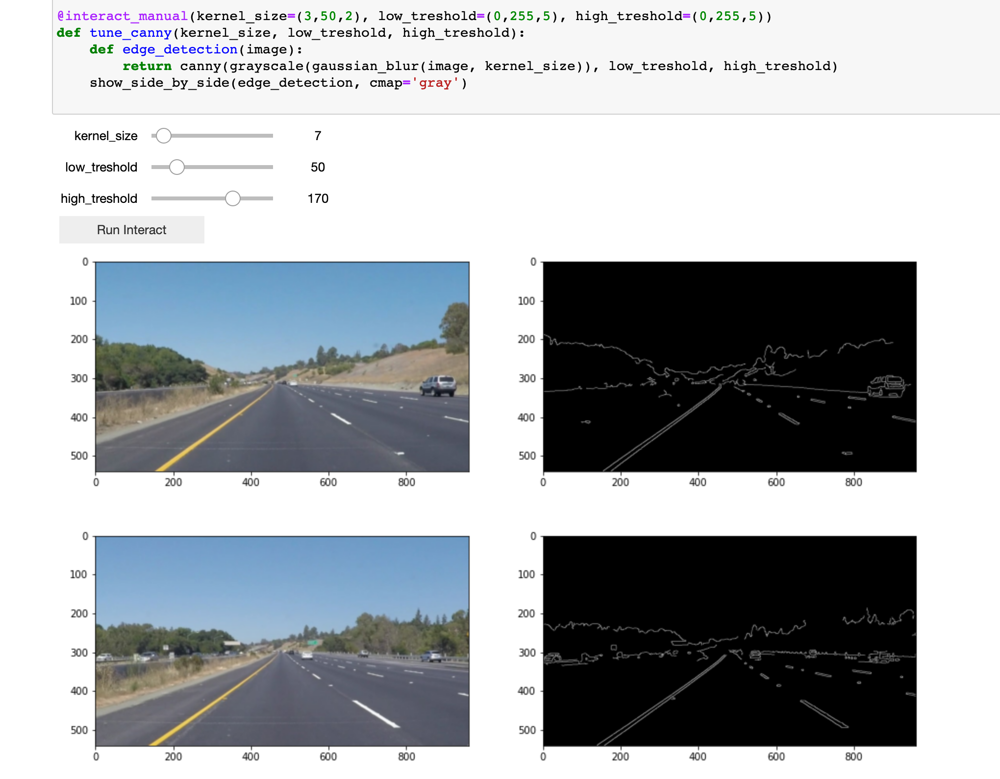
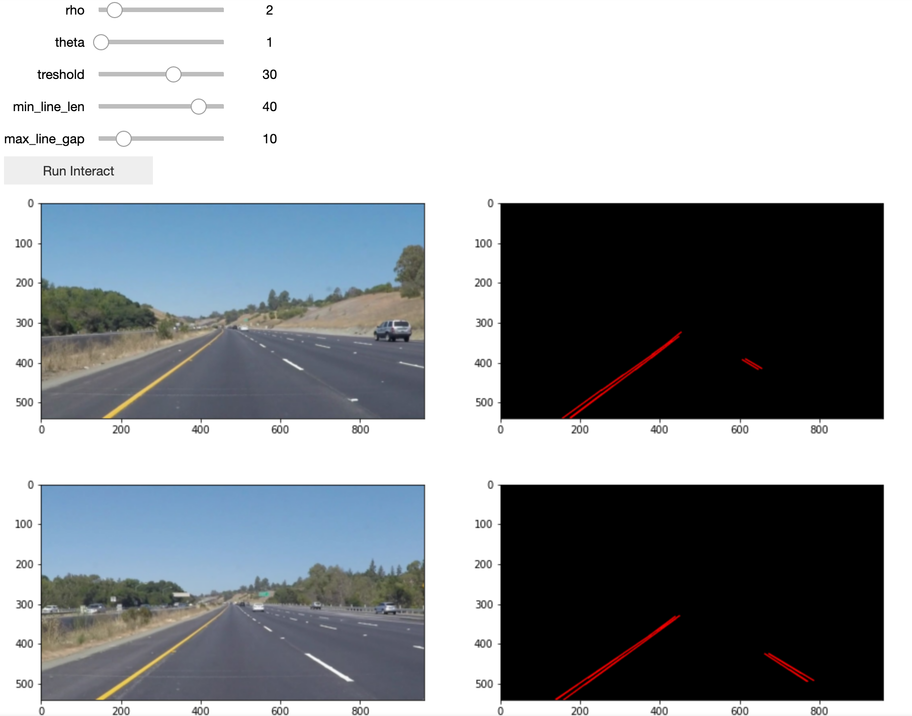

# **Finding Lane Lines on the Road** 

## Writeup Template

### You can use this file as a template for your writeup if you want to submit it as a markdown file. But feel free to use some other method and submit a pdf if you prefer.

---

**Finding Lane Lines on the Road**

The goals / steps of this project are the following:
* Make a pipeline that finds lane lines on the road
* Reflect on your work in a written report

---

### Reflection

### 1. Describe your pipeline. As part of the description, explain how you modified the draw_lines() function.

My pipeline consisted of the following steps:
* First apply a gaussian blur to the image. 
* Convert the image to grayscale
* Apply the Canny transform.
* Extract the region of interest
* Find the lines via Hough lines transform

Almost every step requires tuning parameters to best fit the example images. I've used [Interact](https://ipywidgets.readthedocs.io/en/latest/examples/Using%20Interact.html) to add sliders in my notebook. This allows me to quickly experiment with the different parameters. I also created a helper function `show_side_by_side` to plot the original test image on the left, and plot the edited image on the right for all test images.

In the screenshot you can see how I was tuning the first 3 steps of the pipeline. 



To get the initial edge detection, I settled on using:
* Gaussian blur with kernel size of 7
* A canny edge detection with a low threshold of 50 and a high threshold of 170

Next I extracted the region. I extracted a trapezoid. Instead of using hard-coded values, I used percentages so I can handle different image sizes. 

To apply the Hough lines transform, I used `@interact_manual` again to find good values. 



I experimented with the values. I also added some screencaps from the video, and finally ended up with:
* rho: 3
* theta: 2
* threshold: 15
* minimum line length: 55
* maximum line gap: 30

To draw extrapolated lines, I took the following steps:
1. I wrote a helper function that gives me the equation for a given line. This gives me the `m` and the `c` in `y = m*x + c`.

```python
def find_equation(line):
    x1, y1, x2, y2 = line
    m = (y2-y1)/(x2-x1)
    c = y1 - (m*x1)
    return (m, c)
```

2. I separated left lines from right lines based on their slope. Left lines have a slope that is negative. Right lines have a slope that is positive. This was initially counter-intuitive to me, the way the coordinate system is presented took me for loop.

```python

def is_left(line):
    (m, c) = find_equation(line)
    return m < 0

def is_right(line):
    (m, c) = find_equation(line)
    return m > 0

left_lines = [line[0] for line in lines if is_left(line[0])]
right_lines = [line[0] for line in lines if is_right(line[0])]
```

3. To extrapolate, I can calculate the x-coordinate using `x = (y-c)/m`. I calulcate x at y position 540 (bottom of image) and at y position 324 (horizon). To handle different image sizes, I used percentages to get those values.

```python
bottom_y = image.shape[0]
horizon_y = 0.6*bottom_y

def extrapolate(line):
    (m, c) = find_equation(line)
    bottom_x = (bottom_y - c) / m
    horizon_x = (horizon_y - c) / m
    return np.array([bottom_x, bottom_y, horizon_x, horizon_y])
```

4. Finally I calculate the average (x,y)-coordinates of all the extrapolated lines.

```python    
def average_line(lines):
    extrapolated = np.array([extrapolate(line) for line in lines])
    return (np.int(np.average(extrapolated[:, 0])), 
            np.int(np.average(extrapolated[:, 1])), 
            np.int(np.average(extrapolated[:, 2])), 
            np.int(np.average(extrapolated[:, 3])))
```

### 2. Identify potential shortcomings with your current pipeline

The first issue I see, is that it's hard to find good values that work in all circumstances. To find the lanes in certain frames of the video, I could increase the maximum line gap or lower the threshold. However, that decreased performance in other frames. In those frames it generated too many noisy lines, skewing the average.

The second issue I noticed in the challenge video, is that a lot depends on extracting the correct region of interest. The camera is positioned slightly different in this video. My current algorithm is assuming the horizon is at a different position than it is in the video.

### 3. Suggest possible improvements to your pipeline

To reduce the amount of noisy lines, I could try to filter the lines that I get back from the Hough lines algorithm. I could for example only take lines into consideration if they have a slope that is within certain bounds. Lanes are rarely at an 80 degree angle.